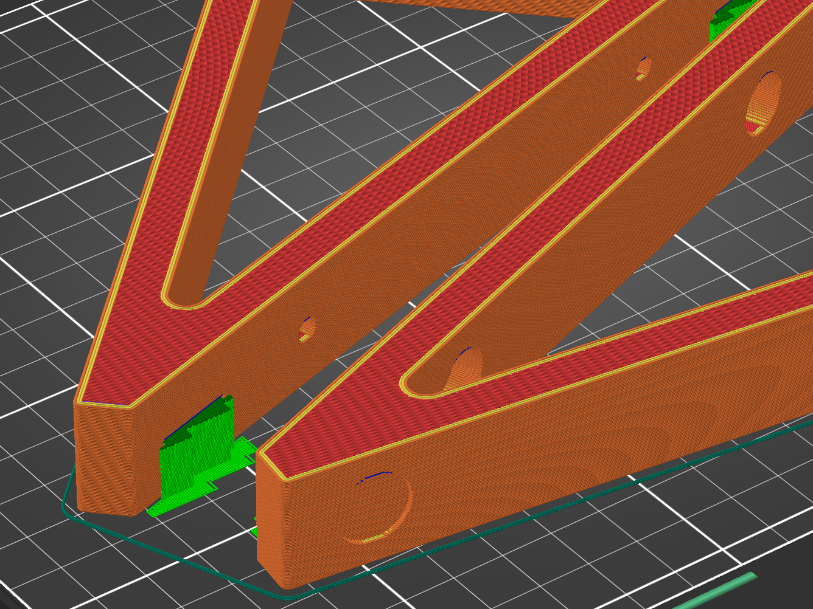

# Parametric 3D-printed stand for Tempera

This is a 3D-printable stand for the [Tempera synthesizer]. It consists of two
parts which attach to the VESA mounting holes on the bottom side and can be
customized in [OpenSCAD].

## BOM

Components used for one part (two needed in total):

- 2× Bottom rubber feet (diameter 12.7mm): 3M Bumpon series SJ5012 (7000001884)
- 2× M4 screws (depending on stand variant)

**Be careful when selecting screws. The maximum thread length inside Tempera is
5 mm. Longer screws may damage the inside.**

## Base stand

**Screws:** M4x8 (DIN 464)

The base stand in `tempera_stand.scad` has an angle of 28 degrees and attaches
using [DIN464 M4x8 screws].

The stand can be also reversed for a steeper angle and an extra pair of rubber
feet can be mounted on the short side.

## Base stand without reversibility

**Screws:** M4x8 (DIN 464)

The base stand has a small step on the rear side which is required to be able to
reverse the stand and have Tempera mounted with an angle of 62° instead of 28°.
In case this is not required, the step can be removed as demonstrated in
file `tempera_stand_simplified.scad`.

## Low profile stand

**Screws**: M4x10 (inbus DIN 912)

The low profile stand in `tempera_stand_low.scad` has an angle of 15 degrees and
attaches using M4x10 inbus (hex) screws as there is not enough space for the
DIN464 screws. The screwdriver holes protrude through the whole body for easier
assembly.

Due to the small angle the stand is not reversible.

## Printing

The stand consists of two parts. Make sure to mirror the second part in the
slicer otherwise the cutouts for Tempera's rubber feet won't fit.

It's recommended to print with the rubber feet cutouts facing the heat bed --
this requires supports but has nicer finish on the surface facing outside.

## License

The Tempera stand is free software: you can redistribute it and/or modify it
under the terms of the GNU General Public License as published by the Free
Software Foundation, either version 3 of the License, or (at your option) any
later version.

See file `COPYING` for details.

[OpenSCAD]: https://www.openscad.org/
[Tempera synthesizer]: https://www.playtempera.com/
[DIN464 M4x8 screws]: https://www.tme.eu/en/details/din464-m4-8/knobs/elesa-ganter/din-464-m4-8/
